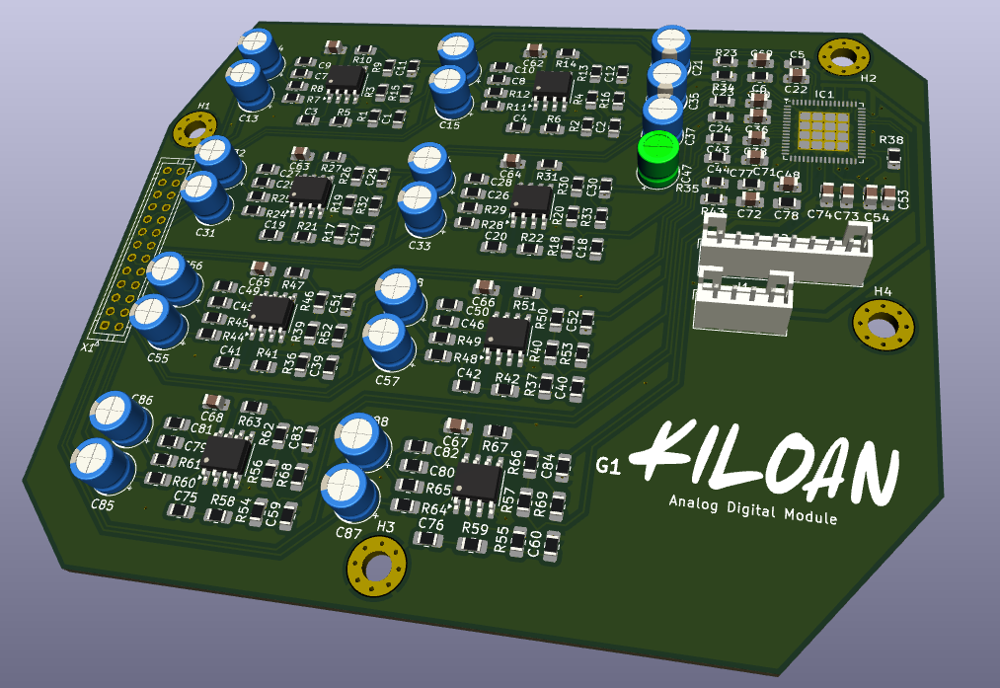
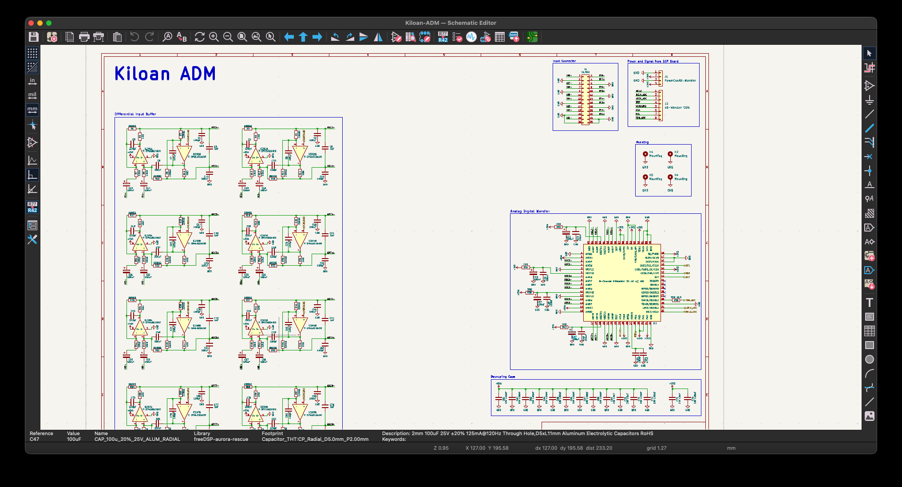
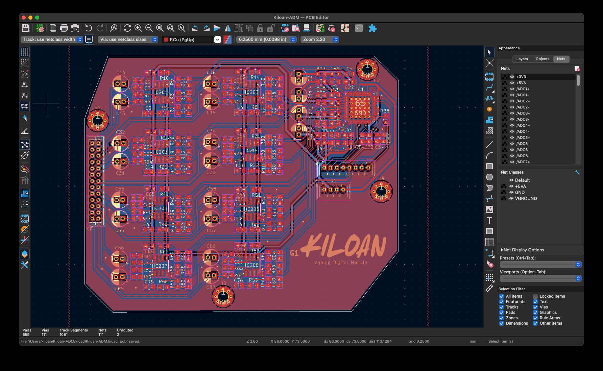

  <h1 align="center">Kiloan ADM V1</h1>

  

  

  <a href="https://blueprint.hackclub.com/">
    </img>
  </a>
  

  <h1></h1>
  

    A 8-Channel Analog to Digital Converter for my custom digital mixing console!
  

This work is licensed under the
[MIT License](https://mit-license.org).

## Table of Contents

- [About](#about)
- [Pictures](#pictures)
- [Bill of Materials](#bill-of-materials)

# About

I've always wanted my own digital mixing console, but those things are just too expensive for teenagers. That's why I want to build my own! This is the expansion board for 8 analog inputs, it receives power from the motherboard and outputs digital signals via the expansion connector to the Kiloan-APU board.

# Pictures

# Bill of Materials

<strong>Show Bill Of Materials(BOM) ----></strong>

|Designator                                                                                                        |Footprint                                  |Quantity|Value                               |LCSC Part #|
|------------------------------------------------------------------------------------------------------------------|-------------------------------------------|--------|------------------------------------|-----------|
|C1, C11, C12, C17, C18, C2, C25, C26, C29, C30, C39, C40, C45, C46, C51, C52, C59, C60, C7, C79, C8, C80, C83, C84|0805                                       |24      |100pF                               |C2167185   |
|C10, C19, C20, C27, C28, C3, C4, C41, C42, C49, C50, C75, C76, C81, C82, C9                                       |0805                                       |16      |220pF                               |C569853    |
|C13, C14, C15, C16, C21, C31, C32, C33, C34, C35, C37, C47, C55, C56, C57, C58, C85, C86, C87, C88                |CP_Radial_D5.0mm_P2.00mm                   |20      |100uF                               |C136287    |
|C22, C36, C38, C48, C53                                                                                           |0805                                       |5       |100nF                               |C3018562   |
|C23, C24, C43, C44, C5, C6, C77, C78                                                                              |0805                                       |8       |1nF                                 |C178423    |
|C54                                                                                                               |0805                                       |1       |4.7uF                               |C162418    |
|C61, C62, C63, C64, C65, C66, C67, C68, C71, C72, C74                                                             |0805                                       |11      |50V 100nF                           |C3018562   |
|C69, C70, C73                                                                                                     |0805                                       |3       |25V 10uF                            |C391262    |
|IC1                                                                                                               |QFN-64-1EP_9x9mm_P0.5mm_EP6x6mm_ThermalVias|1       |8-Channel Differential 32-bit △∑ ADC|C2655448   |
|IC201, IC202, IC203, IC204, IC205, IC206, IC207, IC208                                                            |SOIC-8_3.9x4.9mm_P1.27mm                   |8       |TI OPA1652AIDR                      |           |
|J1                                                                                                                |JST_PH_B4B-PH-K_1x04_P2.00mm_Vertical      |1       |PowerConAD-Wandler                  |C131334    |
|J2                                                                                                                |JST_PH_B8B-PH-K_1x08_P2.00mm_Vertical      |1       |AD-Wandler CON                      |C157974    |
|R1, R15, R16, R17, R18, R2, R32, R33, R36, R37, R52, R53, R54, R55, R68, R69                                      |0805                                       |16      |6800Ω                               |C2092414   |
|R10, R14, R21, R22, R27, R31, R41, R42, R47, R5, R51, R58, R59, R6, R63, R67                                      |0805                                       |16      |10Ω                                 |C2479122   |
|R11, R12, R24, R25, R28, R29, R44, R45, R48, R49, R60, R61, R64, R65, R7, R8                                      |0805                                       |16      |10kΩ                                |C2441435   |
|R13, R19, R20, R26, R3, R30, R39, R4, R40, R46, R50, R56, R57, R62, R66, R9                                       |0805                                       |16      |2200Ω                               |C2085959   |
|R23, R34, R35, R43                                                                                                |0805                                       |4       |20Ω                                 |C114557    |
|R38                                                                                                               |0805                                       |1       |33Ω ±1%                             |C126353    |
|X1                                                                                                                |JST_PHD_B26B-PHDSS_2x13_P2.00mm_Vertical   |1       |IN_CON                              |C3011993   |
| LCSC Quote: 47,54 Dollar + JLCPCP Quote: 27,65 Dollar                                                                                                                |    |        |                              |    |

